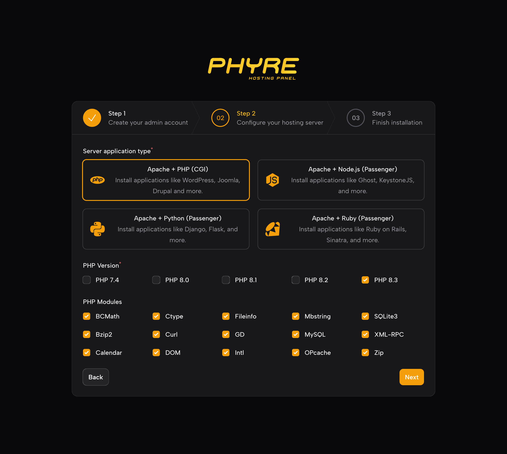
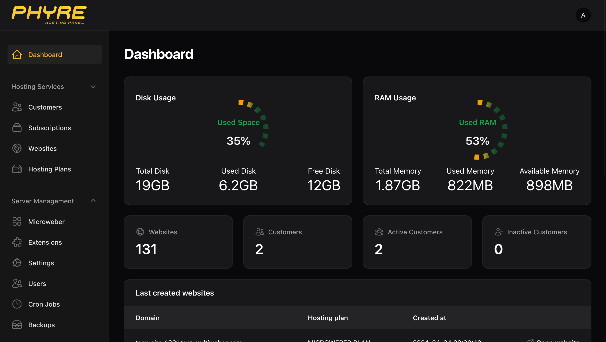

# PHYRE - WEB HOSTING PANEL




## Introduction
PhyrePanel is a web-based panel for linux. It is written in PHP and uses the Laravel framework.

## Installation
To install PhyrePanel, you need to run this commands:
```
wget https://raw.githubusercontent.com/PhyreApps/PhyrePanel/main/installers/install.sh && chmod +x install.sh && ./install.sh
```
The admin panel can be opened on port: yourserver.com:8443

## Features

### Server Applications
Apache + PHP 7.4, 8.0, 8.1, 8.3, 8.4

Apache + NGINX

Apache + Python

Apache + Ruby

### Databases
MySQL

SQLITE

Remote Database Connections

### UI/UX / Developing
Clean Admin Panel

Server Clustering

Easy Module Developing

## Join to our discord group
https://discord.gg/yfFWfrfwTZ

